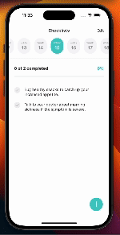

# 실행 방법

1. `yarn install`
2. `cd ios`
3. `pod install`
4. `yarn start`

# fronted-assignment 과제 시 마주쳤던 문제들 및 해결 과정

## 1. 네비게이션 헤더의 Edit 버튼 처리

네비게이션 헤더에 Edit 버튼이 있어, 해당 버튼의 콜백 처리를 어떻게 할지 고민하다가 네비게이션 기본 옵션으로 동적으로 생성 후, 해당 콜백을 받게 처리하였습니다.

## 2. Week Item 목록의 정렬 문제

Week Item의 목록이 왼쪽에서부터 렌더링되어 문제가 발생했습니다. 이를 해결하기 위해 화면의 width 값의 반과 아이템 width의 반을 뺀 값으로 패딩 처리하여 중앙에서 시작되도록 조정하였습니다.

## 3. Context API를 사용한 전역 상태 관리

Context API를 활용하여 전역으로 상태를 관리했지만, 상태가 변경될 때마다 불필요한 렌더링이 발생하는 문제를 해결하기 위해 `useMemo`와 `memo`를 적극 활용하였습니다.

## 4. CRUD 작업 시 타겟 식별 어려움

샘플 JSON 데이터에는 기본적인 정보만 존재하여 CRUD 작업 시 타겟을 식별하는데 어려움이 있었습니다. 이를 위해 초기값과 생성 시마다 UUID를 활용하여 유니크한 식별자를 부여하였습니다.

## 5. Week 별 목록이 부족한 데이터

샘플 JSON 데이터에는 Week 별로 데이터가 부족한 상황에서 전체 목록을 불러와 처리하면 처리 속도가 느려질 우려가 있었습니다. 이를 해결하기 위해 `Map`을 활용하여 해당 Week의 목록만을 내려받아 렌더링하도록 처리했습니다.

## 6. Week 값 변경 시 슬라이드 애니메이션 이슈

Week 값이 변경될 때마다 현재 Week보다 작은 경우에는 왼쪽, 큰 경우에는 오른쪽에서 슬라이드 애니메이션을 적용해야 하는데, 새로 렌더링되어야만 애니메이션이 적용되는 문제가 있었습니다. 이를 해결하기 위해 Week 값을 초기화한 후, 다시 설정하여 정상 동작하도록 처리했습니다.

## 7. 키보드 이벤트에 따른 UI 겹침 현상

키보드 이벤트 발생 시 Input과 레이아웃이 겹치는 현상을 해결하기 위해 `KeyboardAvoidingView`에 스타일을 적용하여 키보드에 Input이 붙을 수 있게 처리했습니다.

# 특별히 신경쓴 부분

1. 폰트 스타일의 중복 사용을 최소화하기 위해 모듈화하여 재활용성을 높였습니다.
2. 아토믹 디자인 패턴을 활용하여 컴포넌트를 분리하여 유지보수성을 향상시켰습니다.
3. Context API를 활용하여 전역 상태 관리를 했으며, 불필요한 렌더링을 최소화하기 위해 `useMemo`와 `memo`를 활용했습니다.
4. 함수의 단일 책임 원칙을 준수하여 가독성을 높였습니다.
5. 네이밍 컨벤션을 일관되게 적용하여 코드 가독성을 향상시켰습니다.

